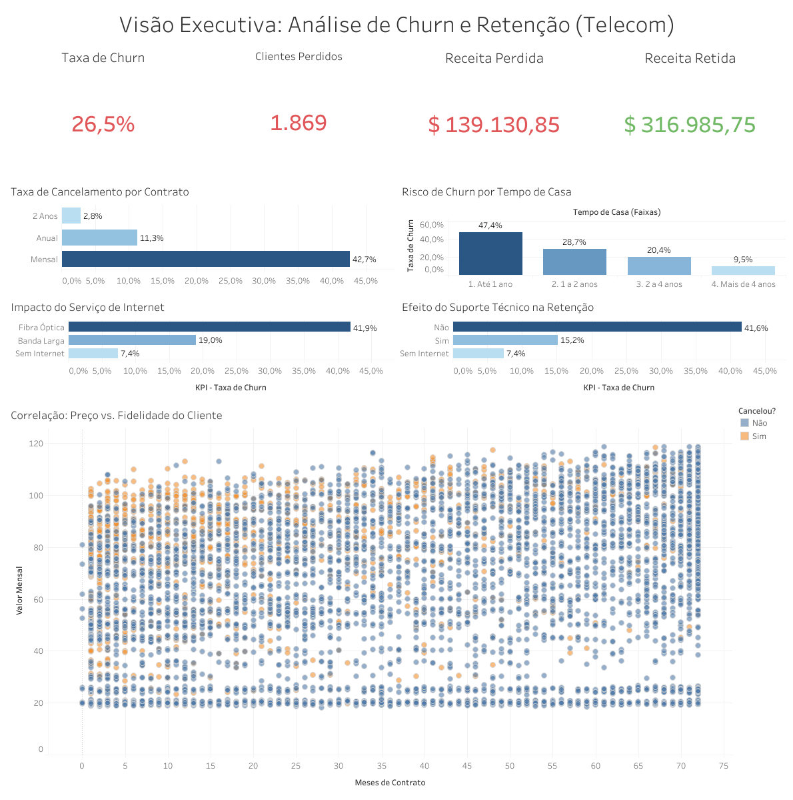

# 📊 Análise de Churn de Clientes (Telecom)

<p align="center">
  
  
  
  
  
</p>

## 🎯 O Problema de Negócio
O *Churn* (taxa de cancelamento) é uma das métricas mais críticas para empresas de serviços por assinatura. Este projeto tem como objetivo analisar uma base de dados de uma empresa de Telecomunicações para identificar quem são os clientes que estão cancelando seus serviços e por que isso está acontecendo. 

A solução construída é um Pipeline de Dados completo: extração via Python, tratamento padronizado com Pandas, modelagem relacional no PostgreSQL, criação de camada semântica e visualização executiva no Tableau.

## 📦 Fonte de Dados
Os dados utilizados neste projeto pertencem ao dataset público **"Telco Customer Churn"**, originalmente disponibilizado pela **IBM** para fins educacionais e de pesquisa, e amplamente distribuído através da plataforma **Kaggle**.
- A base contém informações de mais de 7.000 clientes, incluindo perfis demográficos, serviços contratados, dados financeiros de conta e o status final de retenção ou cancelamento (*Churn*).
- Para entender o detalhamento e as regras de negócio de cada variável, consulte o nosso [Dicionário de Dados](data/data_dictionary.md).

## 📈 Dashboard Executivo (Tableau)
O resultado final da modelagem de dados e a visão executiva interativa podem ser acessados publicamente no Tableau Public:
👉 **[Acessar o Painel Interativo de Churn](https://public.tableau.com/app/profile/m.rcio.pierre.santos.monteiro/viz/Customer_Retention_and_Churn_Dashboard/Painel1#1)**



## 💡 Principais Insights e Recomendações de Negócio

O objetivo de um projeto de dados não é apenas gerar gráficos, mas direcionar a tomada de decisão. Através da Análise Exploratória e do Dashboard, diagnosticamos que a taxa global de churn da empresa é de **26,5%** (resultando em uma perda mensal de $139 mil). 

No entanto, o Churn não é aleatório. Ele segue padrões claros de comportamento e produto:

### 🔍 Descobertas Chave (O Diagnóstico)
1. **A Armadilha do Contrato Mensal:** O contrato *Month-to-month* é o maior ofensor da empresa, com uma taxa de cancelamento assustadora de **42,7%**. Em contrapartida, clientes com contratos de 1 ou 2 anos têm taxas de evasão quase nulas (11% e 2%, respectivamente).
2. **O Paradoxo da Fibra Óptica:** O serviço de Fibra Óptica, que teoricamente deveria ser o produto premium e mais rápido, lidera os cancelamentos (**41,9%** contra apenas 19% do cabo DSL). Isso indica um sério problema de qualidade técnica, instabilidade da rede ou preço descolado da concorrência.
3. **Falta de Retenção por Suporte:** Clientes que não possuem Suporte Técnico contratado cancelam em massa (**41,6%**). O cliente que enfrenta problemas e não tem um canal rápido de ajuda simplesmente abandona o provedor.
4. **Sensibilidade ao Preço Inicial:** A análise de dispersão provou que a maior concentração de cancelamentos ocorre nos primeiros meses de vida do cliente (até 12 meses), especialmente naqueles que recebem faturas com valores mais altos.

### 🎯 Plano de Ação (Próximos Passos Sugeridos)
Com base nos dados, a equipe de Produto e Vendas deve focar em:
* **Campanhas de Migração (Upsell):** Oferecer descontos agressivos na fatura para clientes do plano Mensal que aceitarem migrar para o plano de fidelidade de 1 ano.
* **Auditoria Operacional na Fibra:** Acionar a equipe de infraestrutura para investigar quedas de sinal ou latência nos clientes de Fibra Óptica, além de rodar uma pesquisa de NPS específica com esse grupo.
* **Bundle de Suporte Técnico:** Passar a embutir o "Suporte Técnico" gratuitamente (ou a um custo irrisório) nos primeiros 6 meses de contrato, período crítico de maior mortalidade (churn) da base.

## 🛠️ Arquitetura e Tecnologias
- **Linguagem:** Python 3 (Pandas, SQLAlchemy, python-dotenv)
- **Banco de Dados:** PostgreSQL
- **Gerenciador de BD:** DBeaver
- **Arquitetura de Dados:** ETL, Single Source of Truth (Views), Semantic Layer
- **Controle de Versão:** Git e GitHub
- **Visualização (Roadmap):** Tableau

## 📂 Estrutura do Projeto
```text
analise-churn-clientes/
├── data/
│   ├── processed/                   # Checkpoint físico dos dados limpos
│   │   └── cleaned_telco_churn.csv
│   └── raw/                         # Dados originais brutos
│       └── WA_Fn-UseC_-Telco-Customer-Churn.csv
├── notebooks/
│   └── analise_churn.ipynb          # Pipeline ETL em Python
├── sql/
│   ├── 01_create_tables.sql         # DDL para criação do schema e tabela bruta
│   ├── 02_vw_churn_analytics.sql    # Camada Semântica
│   └── 03_analise_exploratoria.sql  # Queries de negócio
├── .env.example                     # Template seguro de variáveis de ambiente
├── .gitignore                       
└── README.md                        # Documentação do projeto
```
## 🚀 Como Reproduzir este Projeto

Para garantir a máxima reprodutibilidade, este projeto resolve caminhos de arquivos dinamicamente e oferece duas formas de execução: o fluxo completo (com Banco de Dados) ou o fluxo simplificado (via arquivo flat).

### Pré-requisitos Gerais
- Python 3.8+ instalado.
- Bibliotecas: `pip install pandas sqlalchemy psycopg2-binary python-dotenv notebook`

### Opção A: Fluxo Completo (PostgreSQL + Camada Semântica)
1. **Configuração de Ambiente:** Faça uma cópia do arquivo `.env.example`, renomeie para `.env` e preencha com as credenciais do seu PostgreSQL local.
2. **Modelagem Física:** Abra o DBeaver, crie um banco chamado `churn_clients` e execute o script `sql/01_create_tables.sql` para criar a estrutura DDL com tipagem forte.
3. **Pipeline ETL:** Execute todas as células do `notebooks/analise_churn.ipynb`. O script fará a limpeza, salvará um checkpoint na pasta `processed` e injetará os dados no banco de forma segura.
4. **Camada Semântica:** No DBeaver, execute o script `sql/02_vw_churn_analytics.sql` para gerar a View oficial do projeto (traduzida e categorizada).
5. **Análise Exploratória:** Execute o script `sql/03_analise_exploratoria.sql` para acessar os insights de negócio, como a taxa de churn por tipo de contrato e o impacto financeiro.

### Opção B: Fluxo Simplificado (Apenas CSV Limpo)
Se você não deseja configurar um banco de dados local, pode acessar diretamente os dados processados:

1. Abra o arquivo `notebooks/analise_churn.ipynb` e execute as células sequencialmente até o **Passo 3 (Checkpoint Físico)**.
2. O script gerará automaticamente o arquivo `cleaned_telco_churn.csv` na pasta `data/processed/` sem tentar conectar ao banco de dados.
3. Você pode importar este arquivo em qualquer ferramenta (Excel, Power BI, Tableau) para consumo imediato.